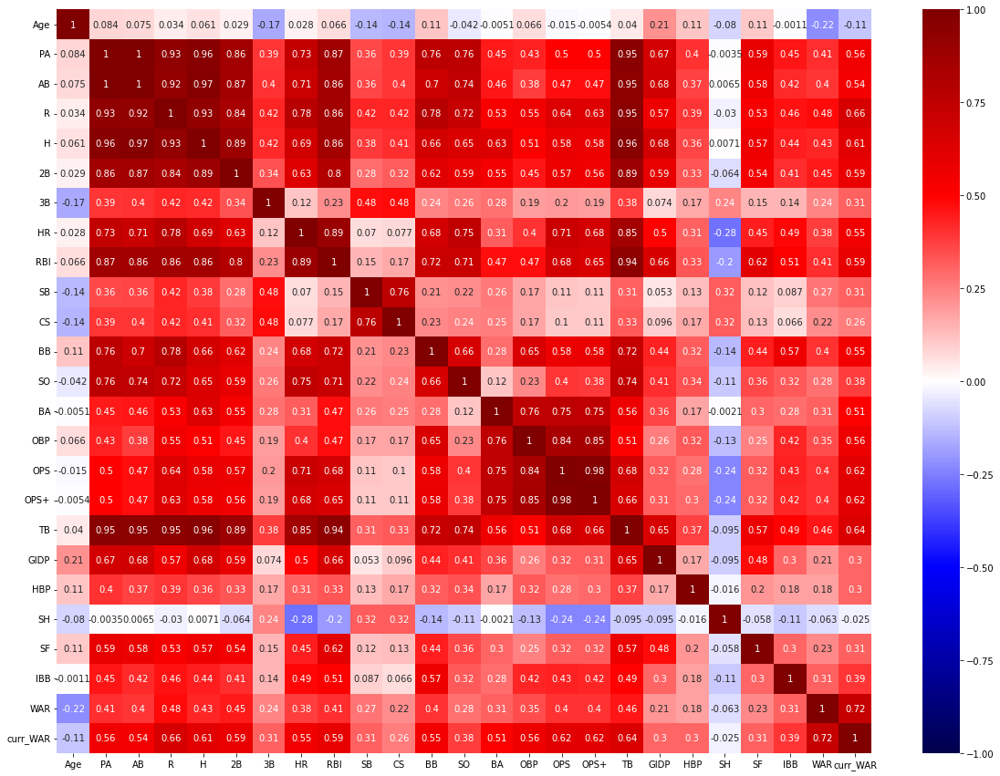
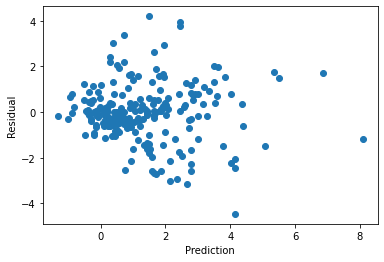
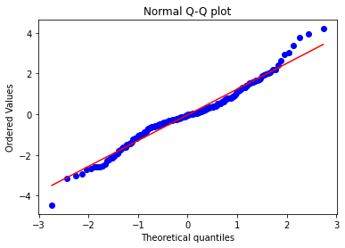

# Linear Regression Project Write-Up
## Predicting MLB Player Value
### Abstract
In this project, I attempted to use linear regression to predict a Major League Baseball (MLB) player's performance in the following season, based on the current season performance. I worked with data from [Baseball-Reference](https://www.baseball-reference.com/). Specifically, I scraped the data using requests and parsed the data using beautifulSoup in order to create a viable Pandas DataFrame. I primarily used scikit-learn to develop models, and visualized data primarily using matplotlib and seaborn, as well as scipy.
### Design
MLB uses a variety of advanced metrics to estimate the value of players. The foremost metric is "Wins Above Replacement" (WAR), which estimates how much better a player was than a replacement-level player. In contrast to "average" players, a replacement-level player is by definition easy to obtain, but much worse than the average starting player. A detailed explanation is available [here](https://www.baseball-reference.com/about/war_explained.shtml). Successful MLB teams must be able to anticipate future changes in player value better than their competitors, in order to trade for and retain the most valuable players - while not overpaying for these trades. 
### Data
The deduplicated dataset consists of 1121 rows, each representing one player's performance in one season, for the 2016, 2017, and 2018 MLB seasons, as well as the player's WAR in the following season (i.e., 2017, 2018, and 2019 respectively). I avoided using post-Pandemic seasons to avoid countless counfounding factors. The dataset has 23 independent variables, and one dependent variable (next season WAR).
### Algorithms and Libraries
As independent variables are on different scales, StandardScaler was used to scale all features. I POC'd basic Linear Regression as well as second-degree Polynomials. Polynomials tended to be a little overfit even at second-degree, so I did not attempt more complex polynomials. Cross-validation for linear regression using LassoCV, RidgeCV, and ElasticNet was ultimately relied on to guide selection of a much smaller number of features and avoid overfitting.
#### Model Evaluation and Selection
The dataset was initially split into 80/20 train/holdout. The training set was further split into 75/25 train/validation, resulting in an 60 train/20 val/20 holdout split. Models were trained using the algorithms descrived above and validated on the validation set. The final model was re-trained on train+val and tested on the holdout.

The goal was to achieve a model that was better than the "baseline" R-squared value of a naive model:
`future WAR = current season WAR`, which had the R-squared value .456

The r-squared value on the final Ridge model was .539

Analysis of the players on which the model performed the worst helped discover potential ways to improve the model in the future. Most significantly, the model struggled with players who simply had a "down" year, because it is not a true time-series model - it does not "look back" farther than one season. It is likely incorporating multiple seasons' worth of data would significantly improve the model.

### Communication
The dataset had significant multicollinearity, as demonstrated by this Seaborn heatmap

Fortunately, the developed model did not appear to have anomalous residuals, which was further validated by consistend r-squared scores across val and the final test set:

Prediction vs.residual plot for final Ridge model

QQ plot for final Ridge model

Obviously, there are outliers, a few of which I look at in depth in the jupyter notebook.